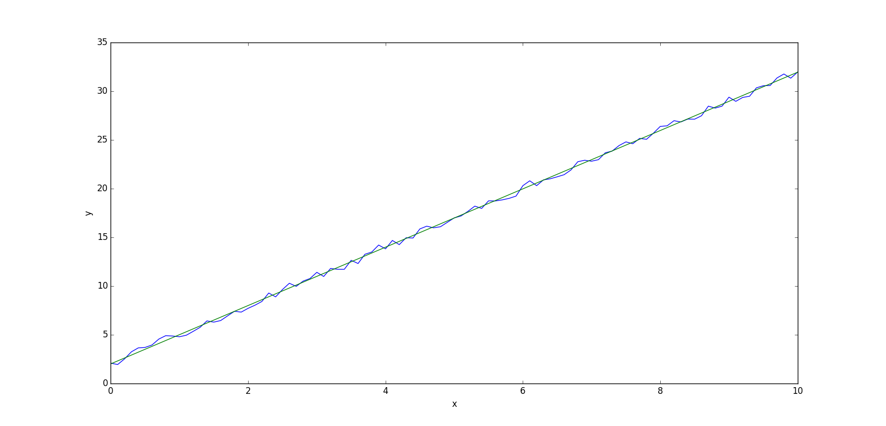
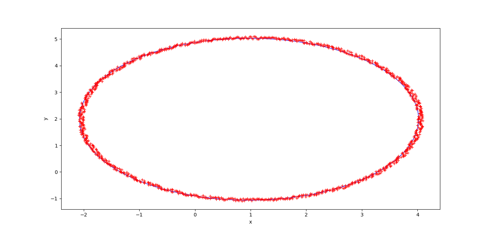

# numpy-example

## Description

Some basic examples written to test [numpy](https://docs.scipy.org/doc/numpy/user/quickstart.html), [matplotlib](https://matplotlib.org/index.html) and [tensorflow](https://www.tensorflow.org/).

## 01-noisy-line

Estimate line using least squares :

[01-noisy-line.py](01-noisy-line.py)

## 02-noisy-circle

Estimate circle using least squares with linearisation :

[02-noisy-circle.py](02-noisy-circle.py)

## 03-noisy-circle-tf

Estimate circle using gradient descent (`tf.keras.optimizers.SGD`) from tensorflow V2 :

[03-noisy-circle-tf.py](03-noisy-circle-tf.py)

